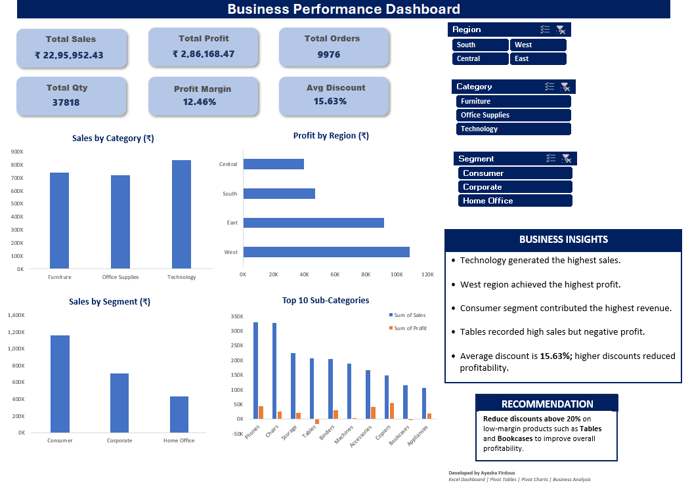
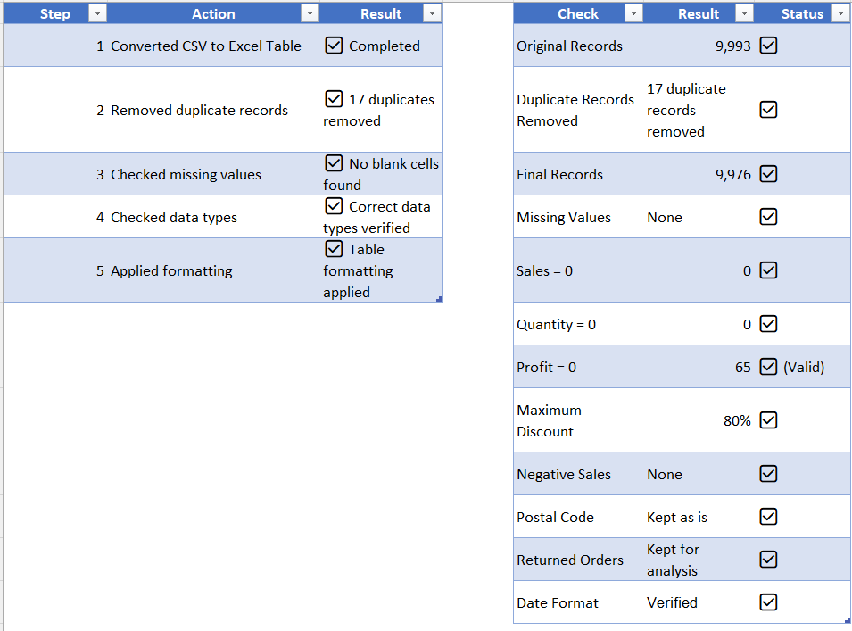
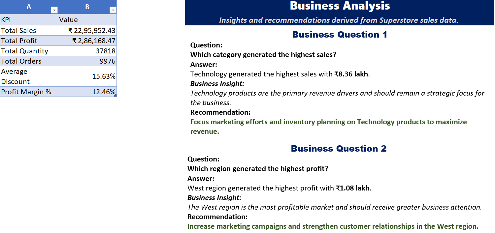
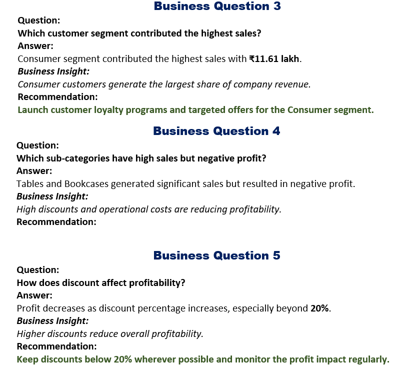
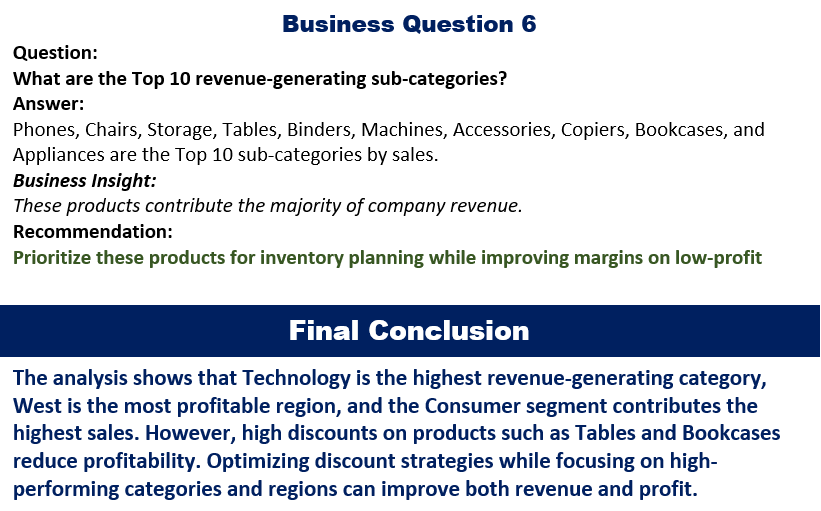

# 📊 Business Performance Dashboard (Microsoft Excel)

An interactive Business Performance Dashboard built in Microsoft Excel using Pivot Tables, Pivot Charts, Slicers, KPIs, and Business Analysis.

This project analyzes Superstore sales data to identify revenue trends, profitability, customer segments, regional performance, and actionable business recommendations.

---

## 📸 Dashboard Preview



---

# 📌 Project Overview

The objective of this project is to transform raw sales data into an interactive business dashboard that enables decision-makers to monitor performance, identify business opportunities, and make data-driven decisions.

The dashboard provides key business metrics, visualizations, business insights, and recommendations through an easy-to-use interface.

---

# 🎯 Business Objectives

- Analyze overall business performance
- Identify the highest revenue-generating category
- Compare profit across regions
- Analyze customer segments
- Identify low-profit sub-categories
- Understand the impact of discounts on profitability
- Provide actionable business recommendations

---

# 📂 Dataset

**Dataset:** Sample Superstore Sales Dataset

The dataset includes:

- Orders
- Sales
- Profit
- Quantity
- Discount
- Category
- Sub-Category
- Region
- Segment
- Customer Information
- Order Date

---

# 📈 Dashboard KPIs

- 💰 Total Sales
- 💵 Total Profit
- 📦 Total Orders
- 📊 Total Quantity
- 📉 Profit Margin
- 🏷️ Average Discount

---

# 📊 Dashboard Features

- Interactive Slicers
  - Region
  - Category
  - Segment

- KPI Cards

- Sales by Category

- Profit by Region

- Sales by Segment

- Top 10 Sub-Categories (Sales vs Profit)

- Business Insights

- Business Recommendation

---

# 🧹 Data Cleaning

The following data cleaning steps were performed:

- Converted CSV to Excel Table
- Removed duplicate records
- Checked missing values
- Verified data types
- Applied formatting
- Validated sales, quantity, profit, and discount values

---

## 📸 Data Cleaning Log



---

# 📊 Business Analysis

The project answers important business questions such as:

1. Which category generated the highest sales?
2. Which region generated the highest profit?
3. Which customer segment contributed the highest revenue?
4. Which sub-categories recorded high sales but negative profit?
5. How do discounts affect profitability?
6. Which products generate the highest revenue?

### Business Analysis Screenshots







---

# 💡 Key Business Insights

- Technology generated the highest sales.
- West region achieved the highest profit.
- Consumer segment contributed the highest revenue.
- Tables recorded high sales but negative profit.
- Higher discounts reduced profitability.

---

# ✅ Recommendation

Reduce discounts above **20%** on low-margin products such as **Tables** and **Bookcases** to improve overall profitability while maintaining healthy revenue.

---

# 🛠 Tools Used

- Microsoft Excel
- Pivot Tables
- Pivot Charts
- Slicers
- Conditional Formatting
- Business Analysis
- Dashboard Design

---

# 💼 Skills Demonstrated

- Data Cleaning
- Data Analysis
- Dashboard Development
- Business Intelligence
- KPI Reporting
- Data Visualization
- Business Insights
- Excel Reporting
- Problem Solving

---

# 📁 Repository Structure

```
Business-Performance-Dashboard-Excel
│
├── Dataset/
│   └── SampleSuperstore.csv
│
├── screenshots/
│   ├── Dashboard.png
│   ├── Data_Cleaning_Log.png
│   ├── Business_Analysis_01.png
│   ├── Business_Analysis_02.png
│   └── Business_Analysis_03.png
│
├── Business_Performance_Dashboard_Excel.xlsx
│
└── README.md
```

---

# 👩‍💻 Developed By

**Ayesha Firdous**

Aspiring Data Analyst passionate about transforming raw data into meaningful business insights using Excel, SQL, Power BI, and Data Visualization.

---

⭐ If you found this project useful, consider giving this repository a Star.
